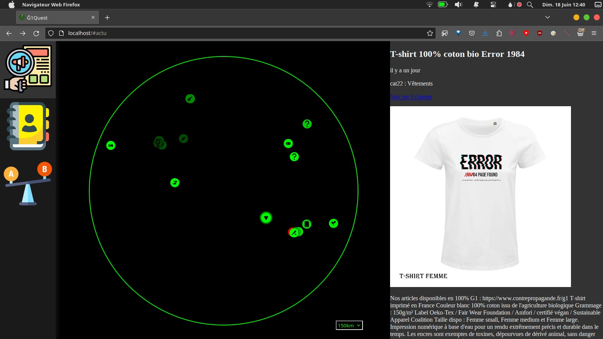

Ğ1Quest : Transformez vos Échanges en Ğ1 en un Jeu Passionnant!
===

J'ai demandé à ChatGPT-4 de m'aider à coder un radar à annonces et pages Gchange, et voilà le résultat :

Voici ma conversation avec lui, telle qu'elle est jusqu'au 10 juin :

https://chat.openai.com/share/41ca5ba2-66c6-4442-bc56-389ebfb7d89b

Autre conversation, où j'utilise les plugins AI Agents, Repo Inspector et Web Requests :

https://chat.openai.com/share/d922cc91-23fa-4f81-8c17-bd5f900eea66

Le nom, la description, et même la suite de ce README été générés avec l'aide de ChatGPT, qui m'a aussi aidé à réfléchir à un favicon :

https://chat.openai.com/share/ddcab1bf-3322-4bd1-b940-28a75d0bc028

Et ChatGPT m'a aussi aidé à penser la conception de l'UX et de l'UI :

https://chat.openai.com/share/3aa7aa47-f7fb-4243-ac45-9058250a0ca7

## ChatGPT vous présente le projet

Ğ1Quest est une application web innovante qui apporte une nouvelle dimension aux échanges en monnaie libre Ğ1. En intégrant des éléments ludiques et une interface dynamique de type "radar", Ğ1Quest rend les transactions en Ğ1 plus attrayantes, plus amusantes et plus accessibles.

Cette application a le potentiel de devenir un levier essentiel pour stimuler l'utilisation de la monnaie libre Ğ1. Elle vise à attirer un public plus large et à encourager une adoption plus généralisée de la Ğ1 en proposant une approche divertissante et engageante de l'économie libre.

De plus, Ğ1Quest offre une immersion dans divers univers thématiques, augmentant ainsi son attractivité et créant un espace d'exploration et de découverte pour ses utilisateurs. Nous croyons que cette application peut redéfinir la façon dont les gens interagissent avec la monnaie libre Ğ1, et nous avons hâte de collaborer avec vous pour continuer à développer et améliorer Ğ1Quest.

## Auteurs

Ce projet est développé par __La Bureautique__, collectif extra-terrestre qui œuvre à la promotion et au développement d'une bureautique ludique et sans bleu clair.

## Licences

Icône loading.gif : Creative Commons 0 (Public Domain) :
https://commons.wikimedia.org/wiki/File:YouTube_loading_symbol_3_(transparent).gif

FontAwesome : Creative Commons BY 4.0

### games/space

- `comparison.png` par [Freepik.com](https://www.freepik.com/)
- `advertising.png` par [Eucalyp](https://www.flaticon.com/authors/eucalyp)
- `contact.png` par [Muhamad Ulum](https://www.flaticon.com/authors/muhamad-ulum)
- `communication.png` par [PureSolution](https://www.flaticon.com/authors/puresolution)
- `sharing.png` par [Eucalyp](https://www.flaticon.com/authors/eucalyp)
- `share.png` par [Freepik.com](https://www.freepik.com/)
- `deliver.png` par [Freepik](https://www.flaticon.com/authors/freepik)
- `drone.png` par [Pixel perfect](https://www.flaticon.com/authors/pixel-perfect)
- `diamond-out-of-a-bag.512.png` par [ultimatearm](https://www.flaticon.com/authors/ultimatearm)
- `calendar.512.png`par [freepik](https://www.flaticon.com/authors/freepik)
- `euro.512.png`par [freepik](https://www.flaticon.com/authors/freepik)

